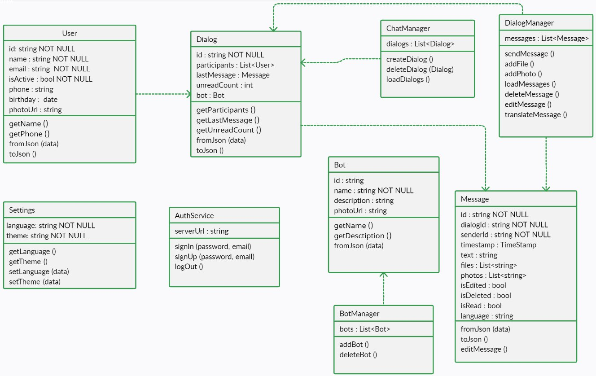

# Виктор Петровский, группа 253505

## Краткое описание проекта

Мессенджер с возможностями перевода сообщений внутри диалогов. Обеспечение коммуникации между пользователями на разных языках, устранение языковых барьеров и упрощение взаимодействия. Возможность подписки на ботов (рассылка новостей, цитат и т.д.).

## Бизнес требования

1.Регистрация и аутентификация.
2.Мультиязычность и перевод сообщений.
3.Диалоги и обмен сообщениями.
4.Подписка на ботов.
5.Мобильная и веб-версия.

## Функциональные требования

1. Регистрация пользователя: Пользователи могут создавать аккаунт, указывая необходимую информацию, такую как имя, электронную почту, номер телефона и дату рождения.
2. Вход пользователя: Пользователи могут войти в приложение, используя свои учетные данные (имя пользователя/электронную почту и пароль).
3. Авторизация через Google: Пользователи могут использовать свои учетные записи Google для авторизации.
4. Управление профилем пользователя: Пользователи могут просматривать свой профиль и редактировать фотографию профиля, номер телефона и дату рождения.
5. Настройки языка: Пользователи могут выбрать язык приложения.
6. Выход из аккаунта: Пользователи могут выйти из своего аккаунта.
7. Поиск пользователей: Пользователи могут искать других пользователей по имени или телефону.
8. Статус пользователя: Приложение отображает статус пользователей (онлайн или офлайн).
9. Создание диалога: Пользователи могут создавать новые диалоги с другими пользователями или ботами.
10. Удаление диалога: Пользователи могут удалять свои диалоги.
11. Список диалогов: Пользователи могут просматривать список своих существующих диалогов, включая количество непрочитанных сообщений и содержимое последнего сообщения в каждом диалоге.
12. Обмен сообщениями: Пользователи могут отправлять и получать сообщения в режиме реального времени внутри диалога, включая текст, фотографии и файлы.
13. Перевод сообщений: Пользователи имеют возможность переводить сообщения на язык, указанный в настройках аккаунта.
14. Удаление и редактирование сообщений: Пользователи могут удалять и редактировать свои сообщения.
15. Управление вложениями: Пользователи могут просматривать все вложения (файлы и фотографии), связанные с сообщением, в отдельном окне.
16. Подписка на ботов: Пользователи могут подписываться на ботов, чтобы получать новости, цитаты и др., сгенерированные ботами.
17. Взаимодействие с ботами: Пользователи могут отправлять и получать сообщения от подписанных ботов внутри диалога с ними.

## Диаграмма классов

## Описание моделей данных

1. user:
- id (уникальный идентификатор пользователя)
- name (имя пользователя)
- email (адрес электронной почты)
- phone (номер телефона)
- birthdate (дата рождения)
- photo (ссылка на фотографию профиля пользователя)
- isActive (онлайн или офлайн)

2. dialog:
- id (уникальный идентификатор диалога)
- participants (список идентификаторов пользователей, участвующих в диалоге)
- lastMessage (последнее сообщение в диалоге)
- unreadCount (количество непрочитанных сообщений в диалоге)
- botId (идентификатор бота, если это диалог с ботом)

3. message:
- id (уникальный идентификатор сообщения)
- dialogId (идентификатор диалога, к которому относится сообщение)
- senderId (идентификатор отправителя сообщения)
- timestamp (время отправки сообщения)
- text (текстовое содержимое сообщения)
- files (список прикрепленных файлов)
- photos (список прикрепленных фото)
- isEdited (было ли изменено сообщение)
- isDeleted (удалено ли сообщение)
- isRead (прочитано ли сообщение)
- language (код языка, на котором было написано сообщение) 

4. bot:
- id (уникальный идентификатор бота)
- name (имя бота)
- description (описание бота и его функций)
- photo (ссылка на фотографию профиля пользователя)
- function (ссылка на используемый api)
	
## Список экранов приложения

1. Экраны авторизации и регистрации
- Возможность создать новую учетную запись или войти в систему с помощью существующей.
- Поддержка авторизации через учетные данные Google.

2. Экран своего профиля
- Просмотр информации о пользователе(фотография, адрес электронной почты, номер телефона, дата рождения).
- Возможность изменить фотографию профиля(выбрать из галереи устройства или сделать снимок на камеру).
- Опция изменения языка приложения.
- Возможность выхода из аккаунта.

3. Экран поиска пользователей
- Поиск других пользователей по имени или фамилии.
- Отображение статуса пользователей (онлайн или офлайн).
- Переход на страницу пользователя при нажатии на элемент списка.
- Поиск бота.

4. Экран профиля другого пользователя:
- Просмотр информации о пользователе (фотография, адрес электронной почты, номер телефона, дата рождения).
- Возможность перейти к диалогу с пользователем при нажатии на кнопку "Написать".

5. Экран списка диалогов
- Поиск диалогов по имени пользователя/бота.
- Отображение количества непрочитанных сообщений и содержимого последнего сообщения в диалоге.
- Отображение статуса пользователей (онлайн или офлайн).
- Возможность удаления диалога.

6. Экран диалога
- Возможность отправки и получения сообщений в реальном времени (текст, фотографии и файлы).
- Отображение времени отправки каждого сообщения.
- Возможность просмотра всех вложений в отдельном окне.
- Возможность перевода сообщения на язык, указанный в настройках пользователя.
- Возможность отправки и получения сообщений от бота, если это диалог с ботом.
- Возможность удаления и редактирования своих сообщений.
